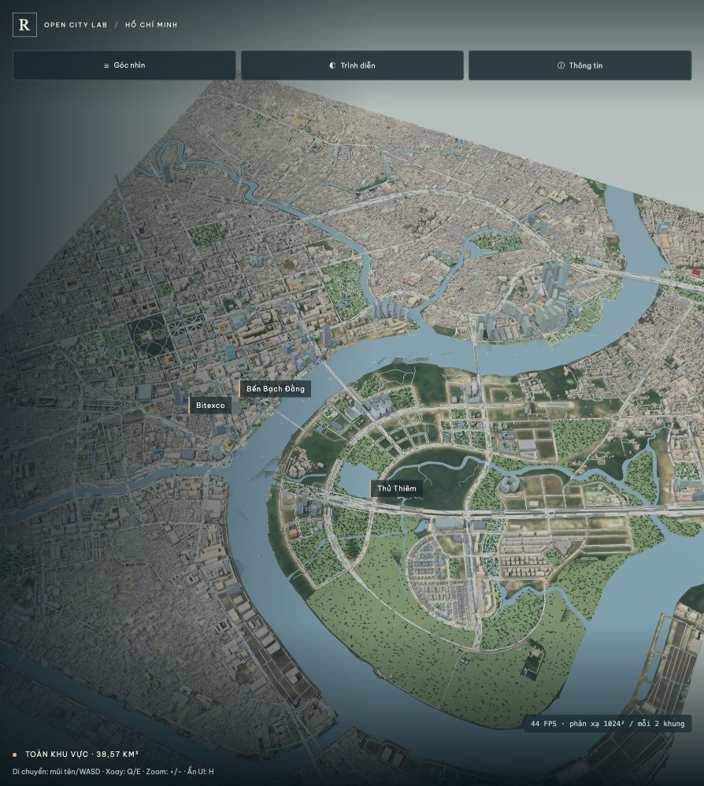

# Saigon Open City Lab

PoC thành phố 3D tương tác cho khu trung tâm Thành phố Hồ Chí Minh, phục vụ nghiên cứu bản đồ số, digital twin đô thị và kinh tế tầm thấp. Mô hình kết hợp dữ liệu mở, hình học thủ tục, các landmark minh họa, lớp kiểm định độ tin cậy và chế độ trình diễn cinematic.



## Chạy tại máy

```sh
python3 outputs/hcmc-poc/serve.py
```

Mở http://127.0.0.1:8768/hcmc-poc/?v=12t-demo . Điểm vào demo sử dụng góc **Toàn khu vực** và ánh sáng ban ngày.

## Điều khiển

- Mũi tên hoặc `WASD`: di chuyển.
- `Q` / `E`: xoay; `+` / `-`: zoom.
- `H`: ẩn giao diện; `F`: toàn màn hình; `0`: đặt lại góc; `Esc`: đóng bảng.

## Kiểm tra và đóng gói

```sh
python3 outputs/hcmc-poc/scripts/validate_demo_ready.py
python3 outputs/hcmc-poc/scripts/package_single.py
python3 work/finalize.py
```

Xem [kịch bản demo](outputs/DEMO-RUNBOOK-POC-12.md), [báo cáo tổng](outputs/BAO-CAO-POC.md) và [ghi chú kiến trúc](outputs/CODEBASE-CLEANUP-POC-12.md).

## Phạm vi sử dụng

Đây là mô hình gần đúng, chưa phải digital twin đã khảo sát và không dùng để điều hướng UAV. Nhiều chiều cao, vật liệu, texture, thiết bị mái và hiệu ứng trình diễn vẫn là dữ liệu suy ra hoặc minh họa có khai báo.

Dữ liệu và thư viện trong dự án có giấy phép riêng, gồm OpenStreetMap/ODbL, các nguồn Overture, EOX/Copernicus, Google Open Buildings, Three.js, Earcut và Poly Haven. Xem attribution và registry nguồn trong `outputs/hcmc-poc/research/` trước khi phân phối sản phẩm dẫn xuất.
