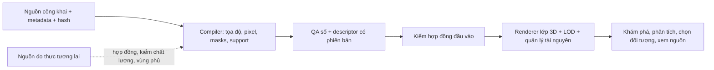

# S06 — nền tảng 3D Gia Lộc cho RtR

Bản nâng cấp áp dụng kết quả điều tra C05 ngay vào bản đồ Batch 04. Dữ liệu công khai, phép đăng ký tọa độ, hình học mô phỏng và trải nghiệm tương tác được quản lý thành các tầng riêng. Khi RtR có dữ liệu đo thực, nguồn mới đi qua bộ chuẩn hóa và kiểm chất lượng trước khi thay lớp tương ứng.

## Trải nghiệm

1. Mở bản đồ, chọn **Đến cụm nhà** để xem rõ mái, mặt đứng và vật liệu. Kéo để xoay, cuộn để thu phóng, kéo chuột phải hoặc dùng mũi tên/WASD để dịch chuyển.
2. Mở **Cách hiển thị** để so sánh GEDTM/COPDEM, chiều đứng 1×/1,35×, chiều cao Google/ước theo diện tích và chi tiết mô phỏng/lớp dữ liệu. Các lớp được dựng lại theo địa hình đang chọn.
3. Chọn công trình để xem nguồn và phương pháp; mở **Nguồn** để đọc hồ sơ dữ liệu. Sáu chế độ giữ riêng tổng quan, địa hình, công trình, tán cây, thủy hệ và biến động.

## Dữ liệu và chi tiết hiện có

| Thành phần | Cơ sở hiện tại | Cách sử dụng |
|---|---|---|
| Ảnh nền | Sentinel-2 L2A, 30/11/2025, native 330×334 pixel, 10 m | UV đăng ký theo tọa độ thực; giữ nguyên ảnh nguồn |
| Địa hình | COPDEM GLO30 và GEDTM dự đoán 2006–2015 | Lưới 109×109; GEDTM có 11.881 node hợp lệ, 217 node biên dùng kernel dự phòng được ghi rõ |
| Công trình | 657 footprint Microsoft | 482 chiều cao mô hình Google 2023 đủ hỗ trợ; 175 chiều cao ước tính; toàn bộ chiều cao đo thực còn thiếu |
| Kiến trúc | Polygon nguồn và kiểu dựng bằng code | Mái, cửa, màu và vật liệu là chi tiết mô phỏng |
| Đường | Vector OSM | Mặt đường bám tam giác địa hình; bề rộng và vật liệu mô phỏng; ghi nhận xung đột với footprint |
| Cây | ETH canopy height/uncertainty 2020 | Lớp phân tích raster liên tục; cây đồ họa phân bố tự nhiên với ràng buộc nhà/đường/nước |
| Thủy hệ | OSM và JRC Global Surface Water | Lớp bằng chứng mô tả, có vùng phủ và thời điểm nguồn |

Miền lưới terrain đi qua tâm pixel nên khác mép ngoài raster và ranh AOI. Renderer cắt hoặc loại phần ngoài miền lưới, giữ nguyên polygon gốc, stable ID và số lượng nguồn để kiểm tra. Sau chuẩn hóa tọa độ, 656/657 công trình và 628/629 đối tượng đường có hình học trong miền hiển thị; số liệu nguồn vẫn được bảo toàn.

## Điểm kỹ thuật đã đầu tư

- Một frame tọa độ thống nhất giữa terrain, ảnh nền và mọi lớp vector. Bộ chuẩn hóa sửa sai khác hệ số mét/độ của bản fusion cũ; geometry nguồn giữ nguyên.
- Lấy chiều cao từ tâm pixel bên trong polygon WGS84 gốc với presence mask và điều kiện hỗ trợ. Giá trị thiếu hoặc không đủ điều kiện dùng lớp dự phòng.
- Móng và mặt đường bám lưới tam giác thực; kiểm bằng THREE.Raycaster độc lập với bộ lấy mẫu dùng khi dựng hình.
- Hình học gộp, cây instancing/LOD, dựng hình theo nhu cầu, cache và hủy tài nguyên khi thay lớp. Có chỉ số CPU, draw calls, tam giác và bộ nhớ để đánh giá.
- Hợp đồng có phiên bản, fingerprint nguồn và hồ sơ QA. Mẫu đầu vào tương lai giữ thông tin chưa có ở trạng thái chờ, chỉ cho sử dụng sau khi đủ nguồn, CRS, datum, ngày, độ phân giải, quyền và chất lượng.

## Giới hạn dữ liệu và bước thay thế

Chi tiết bằng code giúp cảnh rõ và dễ tương tác hơn. Để xác nhận hình dáng từng mái, mặt đứng, cây cá thể và chi tiết đường, cần ảnh có độ phân giải, tọa độ, vùng phủ và quyền sử dụng phù hợp. C05 chưa xác minh được bộ ảnh RGB miễn phí dưới 1 m sử dụng được cho đúng AOI. Khi nguồn phù hợp xuất hiện, ưu tiên thay ảnh nền, địa hình đo, chiều cao và mesh theo từng lớp; kiểm lại tọa độ, datum, vùng phủ và sai số trước khi công bố mức chính xác.

Hồ sơ nghiệm thu: `governance/VERIFY-S06.md`. Hợp đồng dữ liệu: `DATA-CONTRACT-S06.md`. Điều tra nguồn: `../tayninh-imagery-campaign-05/`.
