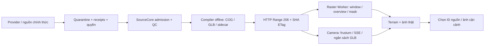

# Batch 18 — từ nguồn thật đến bản đồ theo vùng

Ngày 14/09/2026. Đã áp dụng vào City Lab TP.HCM, trong vùng mẫu trung tâm khoảng 38,57 km². Phạm vi không đại diện toàn địa giới thành phố. [Bản đồ nền](http://127.0.0.1:8768/hcmc-poc/?v=18b&view=overview) · [Ảnh và địa hình](http://127.0.0.1:8768/hcmc-poc/?v=18b&view=surface18).

## Dữ liệu đã tiếp nhận

| Lớp | Đầu vào thực | Vai trò và giới hạn |
|---|---|---|
| Màu bề mặt | Sentinel-2B ngày 26/04/2026; RGB 601 × 645; lưới nguồn 10 m | Ảnh quan sát, không phải orthophoto 1 cm hay mặt đứng công trình |
| Mặt đất | GEDTM30 v1.2; 198 × 212; lưới tệp khoảng 31 m | Terrain dự đoán, EGM2008; kỳ dữ liệu 2006–2015, mục đích thử nghiệm; chưa kiểm điểm đo địa phương |
| Bề mặt | Copernicus GLO-30 DSM, cùng lưới crop | Giữ riêng công trình/cây và mặt đất; ngày thu nhận tile chưa xác định |
| Bất định | GEDTM model spread; 367 pixel NoData | Đã đọc và kiểm mask; không coi là sai số đo nghiệm thu; chưa có lớp tô màu tương tác riêng |
| Công trình | Scene OSM/Overture đã có, 70.709 biểu diễn nguồn | Chiều cao nguồn hoặc ước lượng; 189 mảnh × 2 mức GLB, giữ ID nguồn |
| Ảnh công trình | 20 ảnh đã lưu, xác minh hash và kích thước | Inspector 2D phóng tệp tham chiếu, credit/giấy phép; một số tệp là thumbnail nguồn. Chuyển tới workflow mặt đứng 3D trước đó khi đủ điều kiện |

Chọn ảnh từ tám ứng viên đã kiểm SCL trên AOI. Ảnh 26/04 có 0% mây/bóng mây và 0% NoData theo phân loại sản phẩm trong cửa sổ kiểm; không tuyên bố đã tìm hết mọi ảnh hay chứng nhận khí quyển độc lập. [Manifest và QC](../../outputs/hcmc-poc/data/surface-18/manifest.json), [nguồn Sentinel](https://dataspace.copernicus.eu/data-collections/copernicus-sentinel-missions/sentinel-2).

`effectiveResolutionM` trong manifest là khoảng cách lưới đầu ra suy ra từ transform, **không phải độ phân giải thực được đo độc lập**. Resampling không tạo thêm chi tiết nhà. GEDTM và DSM có phương pháp/kỳ dữ liệu khác nhau: 7.422 chênh lệch DSM−DTM âm trên 41.976 mẫu; không dùng hiệu này làm chiều cao từng nhà/cây. [GEDTM producer](https://github.com/openlandmap/GEDTM30/releases), [Copernicus DEM producer](https://dataspace.copernicus.eu/explore-data/data-collections/copernicus-contributing-missions/collections-description/COP-DEM).

## Luồng đã triển khai

Compiler giữ source window, transform, scale/offset, NoData, ngày và quyền. Không gắn hash bản crop cho toàn raster toàn cầu. GeoTIFF.js ổn định 3.0.5/MIT được pin trong vendor và chạy trong Worker; Three.js r128 được giữ. [GeoTIFF.js release](https://github.com/geotiffjs/geotiff.js/releases/tag/v3.0.5).

Runtime yêu cầu 206, Content-Range và ETag khớp fingerprint offline, chặn phản hồi 200 toàn tệp trước khi đọc body. Giới hạn đầu ra 512² pixel, LRU tám patch/16 MiB, block cache 2 MiB mỗi asset, tối đa 32 mảnh/32 MiB GLB hoạt động; GLB và sidecar được hash trước parse. Cancel, timeout, đổi generation, dữ liệu ngoài vùng và NoData đều có lỗi rõ.

Ảnh toàn vùng ban đầu dùng overview 256²; patch gần camera đọc tới lưới nguồn, không upsample thành GSD nhỏ hơn. Blocks COG hiện 512 pixel: phép đọc off-grid mẫu cần 786.432/1.199.280 bytes; lặp patch không thêm bytes. Vì vậy lợi ích tải chọn lọc phụ thuộc kích thước block/vùng, không mặc định mỗi cửa sổ nhỏ đều chỉ tải ít byte. Nền số rất nhỏ khoảng 185 KB được đọc đủ lưới qua 206 để nội suy; không có fallback HTTP 200.

DTM, công trình và đường mặt đất dùng nội suy tâm pixel và cùng mốc tham chiếu 3,8793262243 m. Nền nhà phẳng tại tâm bbox footprint; chưa là móng bám từng đỉnh địa hình. Cầu/hầm không được suy chiều cao và được bỏ khỏi lớp đường drape; thủy hệ chỉ có đường viền đối chiếu. Display trừ mốc EGM2008, chưa chuyển cao độ sang ellipsoid hoặc hệ nghiệm thu. ENU→ECEF của tileset dùng gốc ellipsoid 0 cho hiển thị; adapter nội bộ East-Up-South được kiểm riêng. [Đặc tả trục 3D Tiles/glTF](https://github.com/CesiumGS/3d-tiles/blob/main/specification/README.adoc).

Fine/coarse là hai mức hình học hiển thị, không phải CityGML LoD2/3. File 3D Tiles 1.1/glTF đã xuất thật; viewer nội bộ đọc subset catalog này, chưa là viewer/conformance 3D Tiles đầy đủ. Cảnh cũ vẫn nạp lúc startup và giữ trong bộ nhớ; đợt này chưa chuyển toàn ứng dụng sang streaming.

## Nguồn chính thức: kết quả truy cập thật

DCAT công khai có 102 dataset trong snapshot. Đã nối dataset → distribution để kiểm năm nhóm không gian, thay vì chỉ đọc trang giới thiệu. Resource quy hoạch 1/2000 tải được là phụ lục cấu trúc CSDL 871.094 bytes, không phải geometry. ZIP hiện trạng rừng 14.759.558 bytes đã tải và kiểm danh mục: quyết định PDF, inventory XLSX và bản đồ PDF; không có vector GIS gốc hay giấy phép trong archive. Giữ quarantine, chưa ingest. Parcel FeatureServer trả 401; một số endpoint khác trả 200 nhưng body rỗng nên không ghi là thành công. [DCAT thành phố](https://opendata.hochiminhcity.gov.vn/catalog.xml), [registry truy cập](../../outputs/hcmc-poc/data/surface-18/official-source-leads.json), [kết quả ZIP](../../outputs/hcmc-poc/data/surface-18/official-forest-quarantine-report.json).

Nguồn chính thức chưa đủ quyền/geometry không được dựng thành quy hoạch tương lai. PDF bản đồ có thể là đầu vào đối chiếu sau khi xác định quyền, CRS, legend, tỷ lệ và sai số georeference; không tự động coi vector hóa PDF là lớp GIS chuẩn đã phê duyệt.

## Vai trò các định dạng và bước sau

| Công nghệ | Tình trạng | Điều kiện bước sau |
|---|---|---|
| COG | Đã đọc window/overview thật trong Worker | Tiếp nhận orthophoto tốt hơn khi có quyền; chọn block size và cache theo workload thực |
| 3D Tiles / GLB | Đã xuất 189 mảnh, hai mức; viewer subset có ngân sách | Chuyển startup cũ sang tile streaming; adapter chuẩn và benchmark máy demo |
| COPC | Chưa có point cloud/decoder | Có LAS/LAZ thực, quyền, CRS/datum, classification và QC; kiểm decoder theo vùng trước tích hợp |
| SfM / 3DGS | Chưa có reconstruction | Hai nhóm ảnh Nhà hát Thành phố cùng ngày được tìm thấy: bốn ảnh tháng 11 và ba ảnh tháng 12/2023, CC BY-SA 4.0. Phải kiểm overlap, calibration, registration và phép đo kiểm trước khi dùng |

100 metadata ảnh đúng khu vực đã được rà, chưa phải 100 tài sản đã tải hay 100 mô hình 3D. [Photo readiness và primary file pages](../../outputs/hcmc-poc/data/surface-18/photo-readiness.json).

Ưu tiên tiếp: thử nghiệm reconstruction có giới hạn tại Nhà hát Thành phố từ hai bộ ứng viên; tiếp cận geometry/orthophoto chính thức có điều kiện sử dụng; đưa streaming thay thế nhánh startup sau benchmark. Dữ liệu tốt hơn đi qua cùng contract, không cần đổi toàn engine. Gia Lộc tiếp tục dùng lõi chung nhưng viewer Batch04 chưa được chuyển sang surface18 trong đợt này. UAV và sa bàn tương lai chỉ mở lại khi có yêu cầu/nguồn hợp lệ.
